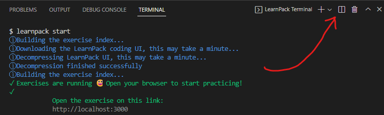

# `01` Installing Node

Antes de comenzar a construir nuestra API, debemos asegurarnos de que todo esté listo para empezar.

## 📝 Instrucciones:

1. Dividir la terminal para tener una terminal vacía para que puedas empezar a usarla.



2. Comprueba si NodeJS está instalado ejecutando este comando: `node -v`. Debería devolver la versión así:

```bash
v.16.14.0
```

3. Si no mostró la versión, significa que no está instalada, entonces puedes seguir estos pasos para instalarla:

    - Ir a https://nodejs.org

    - Descarga la versión recomendada.

    - Ejecuta el instalador.

    - Acepta términos y condiciones y siguiente, siguiente, siguiente...